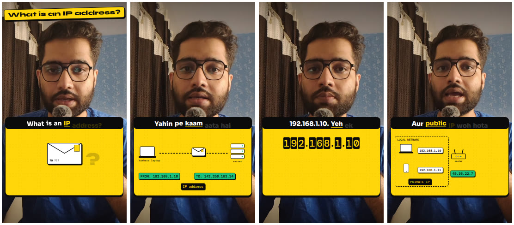
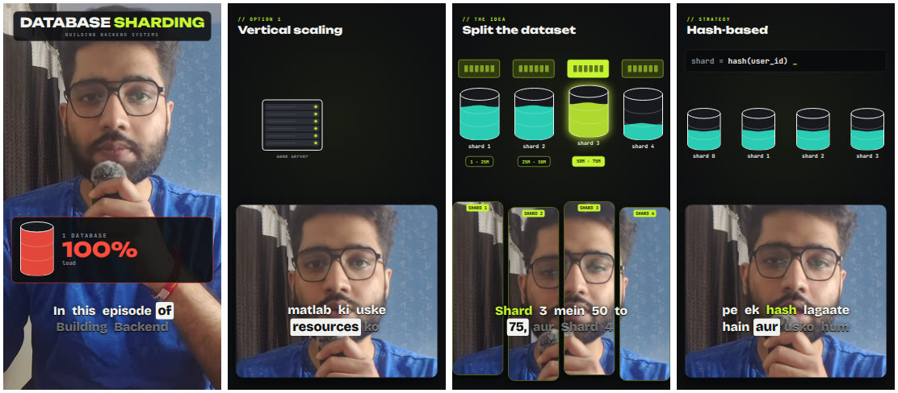
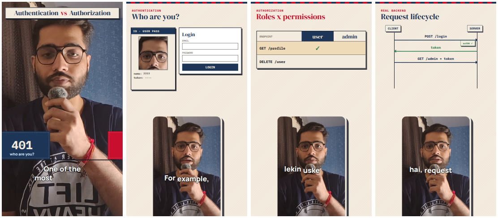
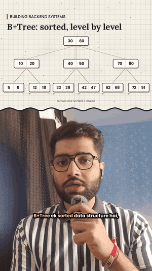
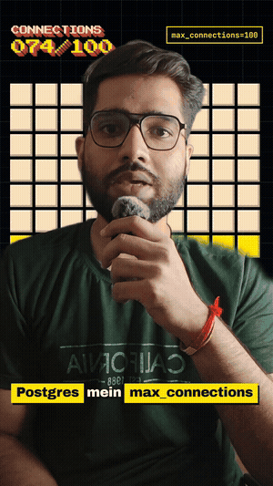

# reel-animated-explainer

A Claude Code plugin marketplace that turns a raw talking-head video into an animated explainer reel: word-timed captions, scenes that land exactly when you say each point, music that ducks under your voice, sound effects, and an Instagram-ready export.

The edit is a [Remotion](https://www.remotion.dev) (React) composition. A small **engine** plugin does the work that is the same for every reel, and **theme** plugins decide the look. Pick a theme, or write your own.

Built while editing the **Building Backend Systems** series.

## Themes

| Theme | Look |
|---|---|
| **yellow-ticker** | Speaker full screen, yellow dotted card with swipe-in scenes, one-line ticker captions, split-flap boards |
| **lime-bento** | Dark grid, lime accents, speaker slides into a bento tile and can split into labelled strips, karaoke captions |
| **cream-passport** | Cream paper, navy and red ink, rubber stamps and ID cards, speaker in a framed card, mustard keyword pills |

<p align="center"></p>
<p align="center"></p>
<p align="center"></p>

## Install

In Claude Code:

```
/plugin marketplace add srvjha/reel-animated-explainer
/plugin install reel-studio@reel-animated-explainer
/plugin install theme-yellow-ticker@reel-animated-explainer
```

Install as many themes as you like (`theme-lime-bento`, `theme-cream-passport`). It runs on your own Claude Code login; nothing else to connect.

## Use

```
/reel-studio:edit-reel ./my-video.mp4
```

or just attach a video and say "edit this reel". Claude asks once (theme, transcript, title, colours to avoid), then:

1. normalizes the video and sets up a Remotion project with your theme
2. transcribes with whisper.cpp and aligns your exact transcript to the audio
3. plans scenes on a timeline and writes `Video.tsx` with the theme's components
4. shows preview frames, fixes overflow and layout
5. renders, mixes music and SFX with ducking, and exports under 30 MB
6. checks frames from the final file and hands you the video

## Requirements

- Node 18+, ffmpeg, Python 3 with `numpy` and `pywhispercpp` (`pip install pywhispercpp numpy`)
- Remotion downloads a headless Chrome on first render (set `REMOTION_BROWSER` to use your own)
- **Remotion licence:** free for individuals and companies of up to 3 people; larger companies need a [company licence](https://www.remotion.dev/license).

## Make your own theme

A theme is a tiny plugin: a `kit.tsx` that exports a `Frame` (background, speaker layout, title, captions, scene transitions) plus the components scenes can use, a `sound.py` (music bed and SFX in pure numpy), and one complete example reel. Run:

```
/reel-studio:make-theme
```

or read [`plugins/reel-studio/skills/make-theme/SKILL.md`](plugins/reel-studio/skills/make-theme/SKILL.md). PRs with new themes are welcome.

## Repo layout

```
.claude-plugin/marketplace.json
plugins/
  reel-studio/            engine: skills (edit-reel, make-theme), Remotion template, pipeline scripts
  theme-yellow-ticker/    skills/yellow-ticker/{SKILL.md, theme/{kit.tsx, sound.py, theme.json, example/}}
  theme-lime-bento/
  theme-cream-passport/
  reel-classic/           the original Python + FFmpeg pipeline (split-panel and full-screen modes)
```

## Classic pipeline

The first version drew every frame in Python and composited with FFmpeg. It still lives in `reel-classic` (`/plugin install reel-classic@reel-animated-explainer`).

<p align="center">
  
  &nbsp;&nbsp;
  
</p>

## License

MIT
